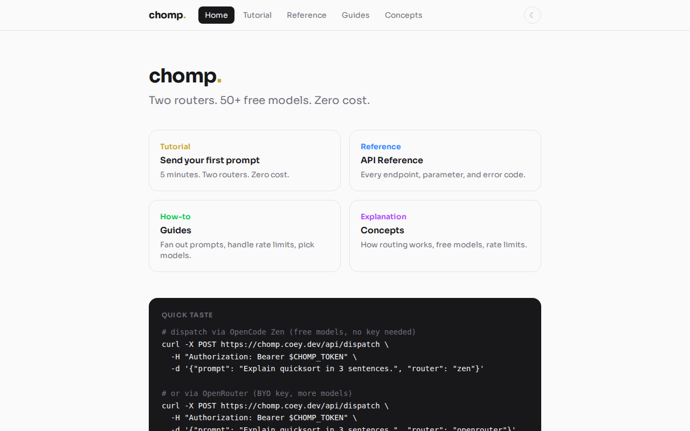

# chomp

Task queue for AI agents. Feed tasks in, agents chew through them, dashboard to watch.

<p align="center">
  
</p>

## Quick start

```bash
# Add to PATH
ln -sf $(pwd)/bin/chomp ~/bin/chomp

# Add tasks
chomp add "refactor the auth module"
chomp add "write tests for billing" --dir ./myapp

# Dispatch
chomp run
```

## Dashboard

```bash
# Docker (persistent, survives reboots)
docker build -t chomp .
docker run -d --name chomp --restart unless-stopped \
  -p 8000:8001 \
  -v $(pwd)/state:/app/state \
  chomp
```

Dashboard at `http://localhost:8000`. Mobile-first, light/dark mode.

## How it works

```
chomp add "task"  \u2192  state.json  \u2192  chomp run  \u2192  agent works  \u2192  chomp done
```

Tasks are strings. Agents are dispatched via adapter scripts. State lives in one JSON file.

## CLI

```
chomp add "task" [--dir /path]    Add a task
chomp list                        Show backlog
chomp status                      Overview + token spend
chomp run [--platform X]          Dispatch next task
chomp done <id> ["summary"]       Mark complete
chomp handoff <id> "context"      Re-queue with progress
chomp drop <id>                   Remove a task
chomp log                         Completed history
```

## Adapters

Shell scripts in `adapters/`. Two functions: `available` and `run`.

```bash
# adapters/myplatform.sh
case "${1:-}" in
  available) command -v myagent &>/dev/null ;;
  run) myagent --message "$TASK_PROMPT" --dir "$TASK_DIR" ;;
esac
```

## Structure

```
chomp/
├── bin/chomp              CLI
├── adapters/              Platform dispatch scripts
├── templates/             Go html/template (HTMX partials)
├── static/                Tailwind CSS
├── server.go              Go server (API + templates)
├── server_test.go         53 tests
├── Dockerfile             Multi-stage build
├── state/                 Runtime state (gitignored)
└── AGENTS.md              Agent/contributor instructions
```

## License

MIT
